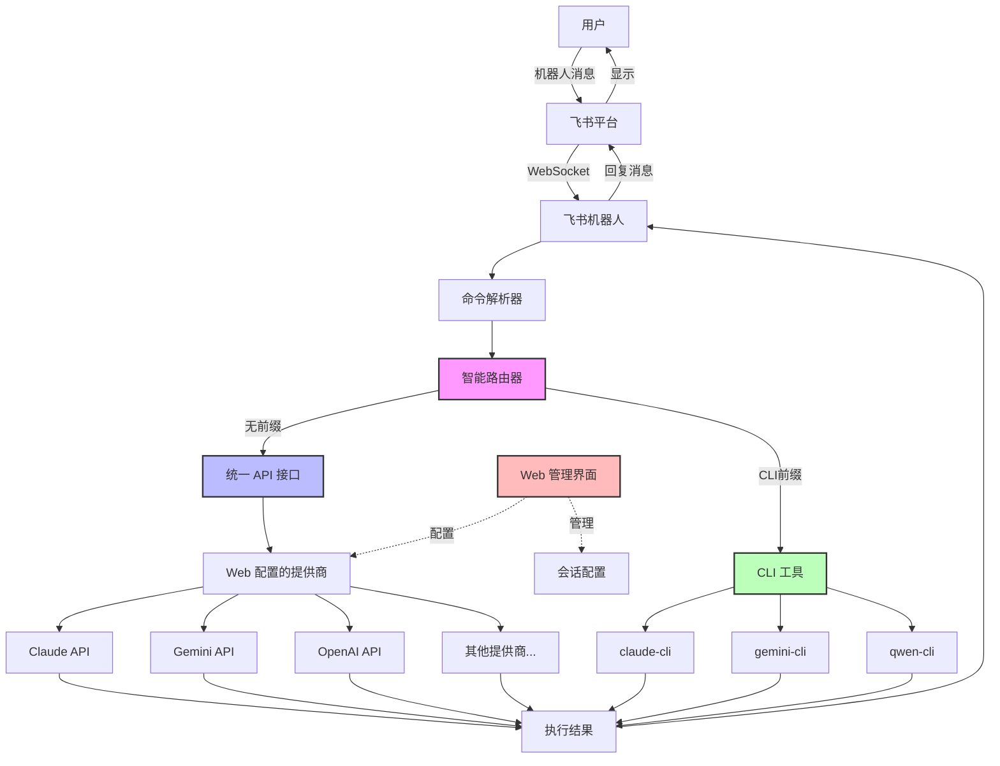
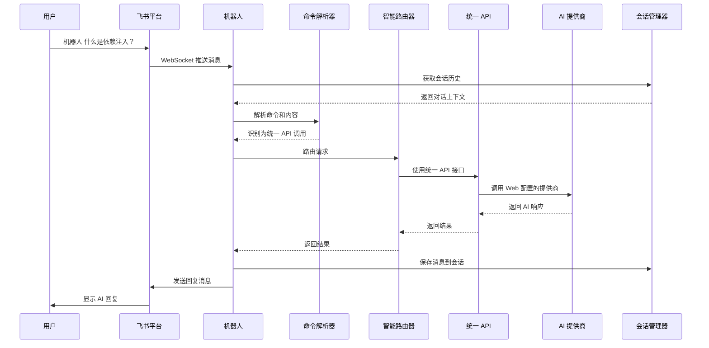
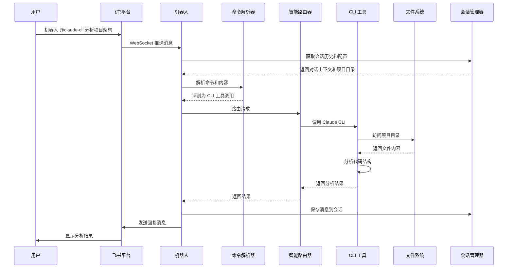
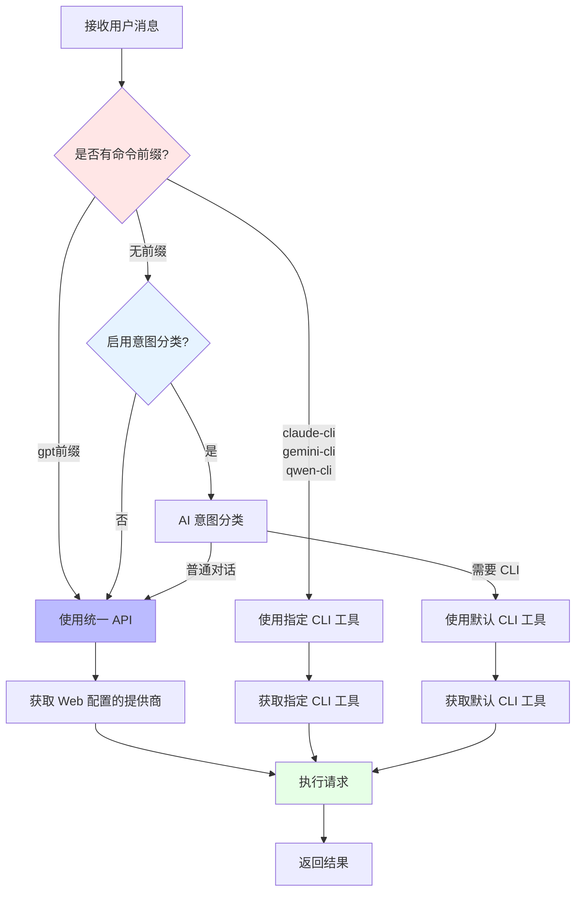
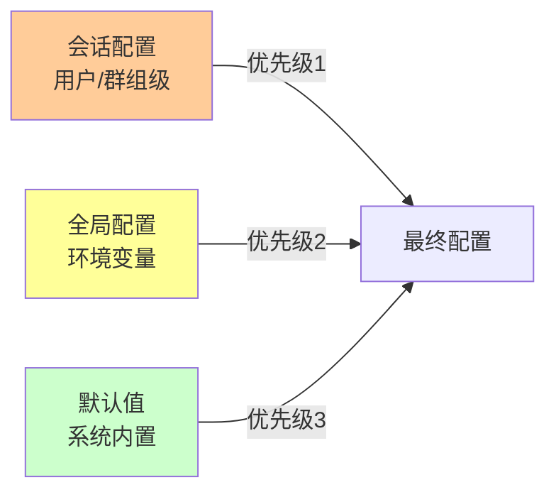

# 飞书 AI 机器人 - 项目介绍

一个功能强大、架构优雅的飞书智能机器人，集成多个主流 AI 服务，支持统一 API 接口、智能路由、会话管理和可视化配置，让团队协作更高效。

## 🌟 核心特性

### 统一 API 接口
- **Web 可视化配置**: 通过 Web 管理界面配置任意 AI 提供商（Claude、Gemini、OpenAI、Qwen 等）
- **统一调用方式**: 使用 `@gpt` 命令调用 Web 配置的提供商，无需记忆多个命令
- **多提供商支持**: 每个提供商可配置多个模型，灵活切换
- **动态更新**: 配置更改实时生效，无需重启服务

### CLI 代码工具
- **Claude CLI**: Anthropic 的代码助手，强大的代码分析和生成能力
- **Gemini CLI**: Google 的代码工具，快速响应
- **Qwen CLI**: 阿里云通义千问代码助手，中文优化

### 智能路由系统
- **无前缀默认**: 不带前缀的消息使用 Web 配置的统一 API 提供商
- **显式指定**: 通过命令前缀精确控制（如 `@claude-cli`、`@gemini-cli`、`@qwen-cli`）
- **智能分类**: 可选的 AI 意图分类，自动识别是否需要 CLI 工具

### 会话管理
- **上下文连续**: 自动维护对话历史，支持连续对话
- **会话隔离**: 每个用户/群组独立会话，互不干扰
- **自动轮换**: 超过消息限制或超时自动创建新会话
- **会话配置**: 支持为不同用户/群组设置不同的配置

### Web 管理界面
- **提供商管理**: 可视化配置 AI 提供商、API 密钥、模型参数
- **会话配置**: 查看和编辑用户/群组的会话配置
- **全局配置**: 管理系统级配置（项目目录、默认 CLI 提供商、语言等）
- **安全认证**: JWT 令牌认证 + 可选速率限制
- **导出导入**: 支持配置备份和迁移

## 🏗️ 系统架构

### 整体架构图



### 用户交互时序图



### CLI 工具交互时序图



### 智能路由决策流程



### 配置优先级层次



### 核心组件

- **命令解析器**: 解析用户命令和前缀，提取意图
- **智能路由器**: 根据命令、内容、配置选择执行器
- **统一 API 接口**: 调用 Web 配置的 AI 提供商
- **CLI 工具集**: 管理 Claude CLI、Gemini CLI、Qwen CLI
- **会话管理器**: 维护对话历史，管理会话生命周期
- **配置管理器**: 处理多层配置优先级，支持动态更新
- **提供商配置管理器**: 管理 AI 提供商配置，支持动态重载

## 🚀 快速开始

### 方式 1: Docker 部署（推荐）

```bash
# 1. 克隆项目
git clone https://github.com/fearofnull/feishu-ai-bot
cd feishu-ai-bot

# 2. 配置环境变量
cp .env.example .env
# 编辑 .env 填入飞书凭证

# 3. 启动服务（包括机器人和 Web 管理界面）
cd deployment/docker
docker-compose up -d

# 4. 查看日志
docker-compose logs -f feishu-bot
```

### 方式 2: 本地运行

```bash
# 1. 安装 Python 依赖
pip install -r requirements.txt

# 2. 构建前端
cd frontend
npm install
npm run build
cd ..

# 3. 配置环境变量
cp .env.example .env
# 编辑 .env 填入配置

# 4. 启动服务（同时启动机器人和 Web 管理界面）
python lark_bot.py
```

### 配置 AI 提供商

1. 访问 Web 管理界面: `http://localhost:8080`
2. 使用 `.env` 中配置的密码登录
3. 进入"提供商配置"页面
4. 添加 AI 提供商（如 Claude、Gemini、OpenAI 等）
5. 配置 API 密钥和模型参数
6. 设置默认提供商

完成后，使用 `@gpt` 命令即可调用配置的提供商。

## 💡 使用示例

### 基本对话（使用统一 API）
```
@机器人 你好，介绍一下自己
@机器人 什么是 Python 装饰器？
@机器人 @gpt 解释量子计算原理
```

### CLI 代码工具
```
@机器人 @claude-cli 分析项目架构
@机器人 @gemini-cli 检查代码质量
@机器人 @qwen-cli 优化这段代码
```

### 会话管理命令
```
@机器人 /help           # 查看帮助
@机器人 /session        # 查看会话信息
@机器人 /history        # 查看对话历史
@机器人 /new            # 创建新会话
```

### 会话配置命令
```
@机器人 /setdir /path/to/project    # 设置项目目录（CLI 工具使用）
@机器人 /lang zh-CN                 # 设置回复语言
@机器人 /cliprovider claude         # 设置默认 CLI 提供商
@机器人 /config                     # 查看当前配置
@机器人 /reset                      # 重置会话配置
```

**注意**: 
- AI 提供商配置请通过 Web 管理界面 (`http://localhost:8080`) 进行管理
- 使用 `@gpt` 命令调用 Web 配置的提供商
- CLI 工具需要通过 `/setdir` 设置项目目录

## 🎯 使用场景

### 场景 1: 技术问答
快速获取技术概念解释、最佳实践建议

```
@机器人 @gpt 什么是依赖注入？有什么优缺点？
@机器人 @gpt 解释 RESTful API 设计原则
```

### 场景 2: 代码生成
生成算法实现、函数模板、代码片段

```
@机器人 @gpt 用 Python 实现二分查找
@机器人 @gpt 写一个 React 自定义 Hook
```

### 场景 3: 代码分析
分析项目架构、代码质量、潜在问题

```
@机器人 @claude-cli 分析这个项目的整体架构
@机器人 @gemini-cli 检查代码中的安全问题
```

### 场景 4: 文件操作
查看文件内容、理解代码结构

```
@机器人 @qwen-cli 查看 README.md
@机器人 @claude-cli 列出 src 目录下的所有文件
```

### 场景 5: 多 AI 对比
通过 Web 管理界面切换不同的 AI 提供商，使用统一的 `@gpt` 命令获取不同 AI 的视角和方案

```
# 在 Web 管理界面切换到 Claude 提供商
@机器人 @gpt 如何优化这段代码？

# 在 Web 管理界面切换到 Gemini 提供商
@机器人 @gpt 你觉得这段代码怎么优化？

# 在 Web 管理界面切换到 OpenAI 提供商
@机器人 @gpt 你的优化建议是什么？
```

### 场景 6: 团队协作
不同项目使用不同配置

```
# 后端团队群组
@机器人 /setdir /team/backend-project
@机器人 /cliprovider claude

# 前端团队群组
@机器人 /setdir /team/frontend-project
@机器人 /cliprovider gemini

# 通过 Web 管理界面为不同团队配置不同的 AI 提供商
```

## 📊 功能对比

### 统一 API vs CLI 工具

| 特性 | 统一 API | CLI 工具 |
|------|---------|---------|
| 调用方式 | `@gpt` 或无前缀 | `@claude-cli`、`@gemini-cli`、`@qwen-cli` |
| 配置方式 | Web 管理界面 | 环境变量 |
| 响应速度 | 快速（秒级） | 较慢（分钟级） |
| 代码访问 | 无法访问本地代码 | 可访问和操作本地代码 |
| 适用场景 | 问答、翻译、写作、代码生成 | 代码分析、文件操作、项目理解 |
| 提供商切换 | Web 界面动态切换 | 需要修改配置 |

### 不同 AI 提供商的特点

通过 Web 管理界面配置不同的 AI 提供商，使用统一的 `@gpt` 命令调用：

| AI 提供商 | 特点 | 适合场景 |
|----------|------|---------|
| Claude | 推理能力强，代码质量高 | 复杂问题、代码分析、架构设计 |
| Gemini | 多模态支持，响应快 | 通用对话、快速问答 |
| OpenAI | 通用性强，生态完善 | 各类场景，特别是创意写作 |
| Qwen | 中文优化，代码能力强 | 中文场景、代码操作 |
| ModelScope | 国内模型，访问稳定 | 国内部署，中文场景 |

**使用方式**: 
1. 在 Web 管理界面添加和配置提供商
2. 设置默认提供商
3. 使用 `@gpt` 命令调用
4. 可随时在 Web 界面切换提供商，无需重启服务

## 🔧 配置说明

### 必需配置

```bash
# 飞书应用凭证（必需）
FEISHU_APP_ID=your_app_id
FEISHU_APP_SECRET=your_app_secret

# Web 管理界面（推荐启用）
ENABLE_WEB_ADMIN=true
WEB_ADMIN_PORT=8080
WEB_ADMIN_PASSWORD=your_secure_password
JWT_SECRET_KEY=your_random_secret_key
```

### AI 提供商配置

**唯一配置方式：Web 管理界面**

1. 访问 `http://localhost:8080` 登录管理界面
2. 进入"提供商配置"页面
3. 点击"添加提供商"按钮
4. 填写提供商信息：
   - 提供商名称（如 Claude、Gemini、OpenAI）
   - API 密钥
   - 模型名称
   - 其他参数（temperature、max_tokens 等）
5. 勾选"设为默认"设置默认提供商
6. 保存配置

**配置优势**：
- 支持多个 AI 提供商和模型
- 可视化管理，操作简单直观
- 动态切换提供商，无需重启服务
- 支持配置导出和导入，便于备份和迁移
- 配置自动重载，实时生效

### 可选配置

```bash
# CLI 工具配置
TARGET_PROJECT_DIR=/path/to/project    # CLI 工具的目标项目目录
DEFAULT_CLI_PROVIDER=claude            # 默认 CLI 提供商（claude/gemini/qwen）

# 系统配置
RESPONSE_LANGUAGE=zh-CN                # AI 回复语言
USE_AI_INTENT_CLASSIFICATION=true     # 是否使用 AI 意图分类

# 会话管理
MAX_SESSION_MESSAGES=50                # 会话最大消息数
SESSION_TIMEOUT=86400                  # 会话超时时间（秒）

# Web 管理界面
WEB_ADMIN_HOST=0.0.0.0                # 监听地址
WEB_ADMIN_LOG_LEVEL=INFO              # 日志级别
WEB_ADMIN_RATE_LIMITING=true          # 是否启用速率限制
```

详细配置说明见 [配置文档](guides/CONFIGURATION.md)。

## 🌐 Web 管理界面

访问 `http://localhost:8080` 使用 Web 管理界面：

### 功能特性
- ✅ **提供商配置管理**: 添加、编辑、删除 AI 提供商，配置 API 密钥和模型参数
- ✅ **会话配置管理**: 查看和编辑用户/群组的会话配置
- ✅ **全局配置查看**: 查看系统级配置（项目目录、默认 CLI 提供商、语言等）
- ✅ **配置导出导入**: 支持配置备份和迁移
- ✅ **智能搜索筛选**: 快速查找配置项

### 提供商配置页面
- 查看所有已配置的 AI 提供商
- 添加新的提供商（Claude、Gemini、OpenAI、Qwen、ModelScope 等）
- 编辑提供商的 API 密钥、模型名称、参数
- 设置默认提供商（用于 `@gpt` 命令）
- 删除不需要的提供商

### 会话配置页面
- 查看所有用户/群组的会话配置
- 编辑会话配置（项目目录、语言、CLI 提供商）
- 删除会话配置

### 全局配置页面
- 查看系统级配置
- 包括：项目目录、默认 CLI 提供商、回复语言、意图分类开关等

### 快速访问
```bash
# 服务启动时自动启动 Web 管理界面
python lark_bot.py

# 浏览器访问
http://localhost:8080

# 使用管理员密码登录
# 密码在 .env 中配置：WEB_ADMIN_PASSWORD
```

详细使用说明见 [Web 管理界面文档](guides/WEB_ADMIN_README.md)。

## 📚 文档资源

### 用户文档
- [用户指南](guides/USER_GUIDE.md) - 如何使用机器人
- [配置指南](guides/CONFIGURATION.md) - 详细配置说明
- [动态配置](guides/DYNAMIC_CONFIG.md) - 会话级配置
- [会话管理](guides/SESSION_MANAGEMENT.md) - 会话管理说明

### 管理文档
- [Web 管理界面](guides/WEB_ADMIN_README.md) - 完整的 Web 管理文档
- [Web 用户指南](guides/WEB_ADMIN_USER_GUIDE.md) - Web 界面使用指南

### 部署文档
- [Docker 部署指南](../deployment/docker/README.md) - Docker 容器化部署
- [部署指南](deployment/DEPLOYMENT.md) - 完整部署文档
- [快速部署](deployment/QUICKSTART.md) - 5 分钟快速部署

### 开发文档
- [项目结构](STRUCTURE.md) - 代码结构说明
- [实现计划](IMPLEMENTATION_PLAN.md) - 开发计划和进度

## 🔒 安全与隐私

### 数据安全
- ✅ 敏感信息本地存储，不提交到 Git
- ✅ API 密钥通过环境变量管理
- ✅ Web 管理界面 JWT 认证 + 速率限制
- ✅ 会话数据加密存储

### 隐私保护
- ✅ 会话数据仅存储在本地
- ✅ 支持手动清理会话历史
- ✅ 会话自动过期和归档
- ✅ 不会将数据发送到第三方（除 AI 服务商）

### 安全建议
- 🔐 使用强密码保护 Web 管理界面
- 🔐 定期更换 API 密钥
- 🔐 限制 Web 管理界面访问（仅本地或通过 VPN）
- 🔐 定期备份配置和会话数据

## 🛠️ 技术栈

### 后端
- **Python 3.8+**: 主要编程语言
- **Flask 3.0+**: Web 框架
- **lark-oapi**: 飞书 Python SDK

### 前端
- **Vue.js 3**: 渐进式 JavaScript 框架
- **Element Plus**: 企业级 UI 组件库
- **Vite**: 快速构建工具
- **Pinia**: 状态管理

### 部署
- **Docker**: 容器化部署
- **Nginx**: 反向代理
- **Systemd**: 服务管理

## 📈 性能优化

### 响应速度
- ✅ 统一 API 秒级响应
- ✅ 消息去重机制
- ✅ 配置缓存和动态重载
- ✅ 响应压缩（gzip）

### 资源使用
- ✅ 会话自动轮换和归档
- ✅ 过期会话自动清理
- ✅ 内存使用优化
- ✅ 日志轮转

## 🤝 贡献指南

欢迎提交 Issue 和 Pull Request！

### 提交 Issue
- 使用清晰的标题描述问题
- 提供详细的复现步骤
- 附上错误日志和截图
- 说明环境信息

### 提交 Pull Request
1. Fork 项目
2. 创建特性分支
3. 提交更改
4. 推送到分支
5. 开启 Pull Request

## 📄 许可证

MIT License

---

**开始使用**: 访问 [快速开始](#-快速开始) 部署你的飞书 AI 机器人！

**获取帮助**: 查看 [用户指南](guides/USER_GUIDE.md) 了解详细使用方法。
